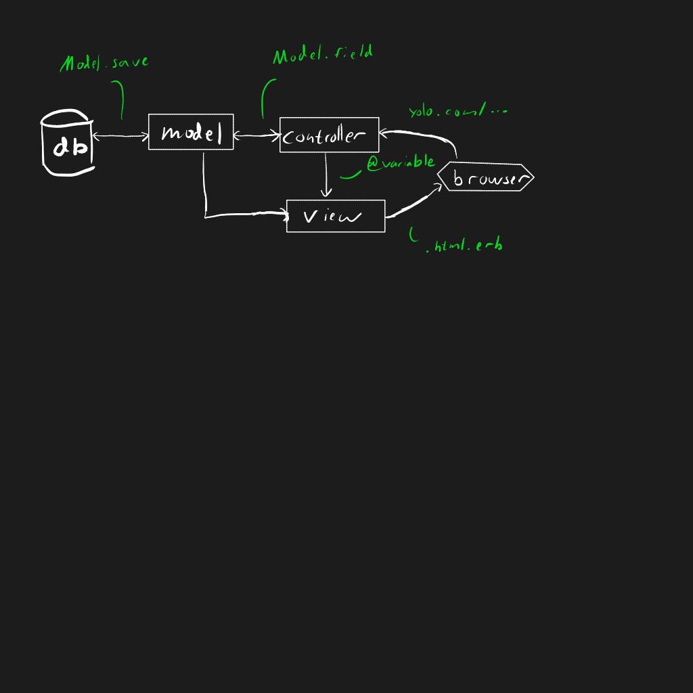

<!-- theme: sjaakvandenberg/cleaver-light -->
<!--theme: jdan/cleaver-retro-->
theme: cleaver-light

---
##Model view controler



---

##Views
Hanterar rendering för klienten
```html
<h1>
    <%= @location.name %>
</h1>

<p>
    <%= @location.description %>
</p>


<h3>
    Leave <%= @location.name %>
</h3>

<table>
    <% @location.neighbours.each do |location| %>
        <tr>
            <td>
                <%= link_to location.name, travel_to_path(location)%>
            </td>
        </tr>
    <% end %>
</table>
```

---
##Controllers
Hanterar input från klienten

```ruby
class GameController < ApplicationController
    def index
        character = Character.find(session[:character_id])

        @location = character.location
    end

    def travel_to
        character = Character.find(session[:character_id])

        target_location = Location.find(params[:id])

        ...

        redirect_to action: "index"
    end
end
```

För rendering krävs `views/<name>.html.erb` eller redirect

---

##Generering

```ruby
#Generera en controller
rails g controller <name>
```

Views måste dock genereras manuellt


---

##Routing
Bestämmer URLer för views/controllers

```
app/routes.rb
```

```ruby
  #Set default route to character_manager.index
  root 'character_manager#index'

  #Make url/character/create route to character_manager.create
  get 'character/create' => 'character_manager#create'

  #Make url/character/deselect route to character_manager.deselect. 
  #Also generate a function called deselect_character_path to get that URL
  get 'character/deselect' => 'character_manager#deselect', as: :deselect_character

  #Make welcome/increment/<id> map to welcome.increment and set params[:id] to
  <id>
  get 'welcome/increment/:id' => 'welcome#increment'
```

---

##Methods

Get är data som ses i URL fältet
```ruby
yoloswag.org/din_mamma?swag=69&level=9001
                      ^^^^^^^^^^^^^^^^^^^
```
Använd inte för känslig data eftersom att det skickas i klartext

Post skickas gömt men struktureras på samma sätt


```ruby
  get 'welcome/increment/:id' => 'welcome#increment'
  post 'welcome/increment/:id' => 'welcome#increment'
```

Rails har även andra methods `patch, delete`

---

##Models
Sparar data

Kan genereras med 
```ruby
rails g model <name> <field>:<datatype> ..

#Generera modell för kontrakt
rails g model contract name:string value:integer ...
```

Data komms åt med
```ruby
#Hitta namnet på kontrakt med ett specifikt id
Contract.find(id).name
```

---
##Relationsdatabaser

Databaser är 2d struktuer, typ excel eller structar där
kolumner är 'variabler' och rader är instanser av 'data'

```
| id | username        | created | permission |
| 0  | swagger123      | ...     | user       |
| 2  | Kaninmannen     | ...     | admin      |
| 3  | Dödsanarkisten1 |         |            |
```

Fälten kan bara innehålla enkla datatyper -> inga listor

---

##Relationsdatabaser

Vi vill att alla users ska ha en lista av kontrakt

```
| id | Company name | created | permission |
| 0  | SAAB         | ...     | user       |
| 1  | Boardeaser   | ...     | admin      |
| 2  | Ericsson     | ...     | user       |
```

```
| id | namn                   | ... | user_id |
| 0  | gripen                 | ... | 0       |
| 1  | Missiler, saudiarabien | ... | 0       |
| 2  | 8G                     | ... | 2       |
            ....
```

Relationen ligger alltså inte i usern, utan i objektet som usern har.

---

##I rails

```ruby
class Location < ActiveRecord::Base
    has_many :paths
    ...
end
```

Fler relationer

```ruby
:belongs_to
:has_many
:has_one
...
```

---
##Ändring av databasen

```bash
rails g migration <namn> user_id:integer
```

Genererar filen
```
db/migrate/<namn>
```
```ruby
class AddLocationToCharacters < ActiveRecord::Migration
  def change
    add_reference :characters, :location, index: true
    add_foreign_key :characters, :location
  end
end
```

Som ändrar databsen som är beskriven i
```
db/schema.db
```

Uppdatera databasen
```
rake db:migrate
```

---

##Session & cookies
Databser sparar länge, ibland vill man spara data halvtemporärt.

Session sparas per webbläsare per instans

Cookies sparas per webbläsare tills cookies ränsas

Man kan komma åt dem med 
```ruby
yolo = session[:namn]
session[:namn] = yolo
```

Används typiskt för att till exempel spara att en användare är inloggad

---
